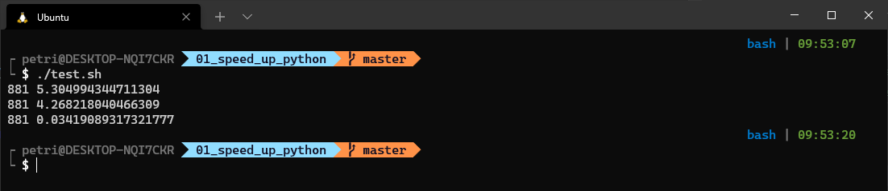

## This is a demonstration on how you can speed up vanilla python code. 

***
1. first folder is vanilla Python
2. second is compiled to c with Cython
3. third has type declarations included

Here is a one run of all of the programs. As we can see optimized code is 155 times faster. 🤔

***
Thank to [pythonist](https://www.youtube.com/channel/UCGbcVi5c9XlAHkqKcHY3lLw) for the inspiration.